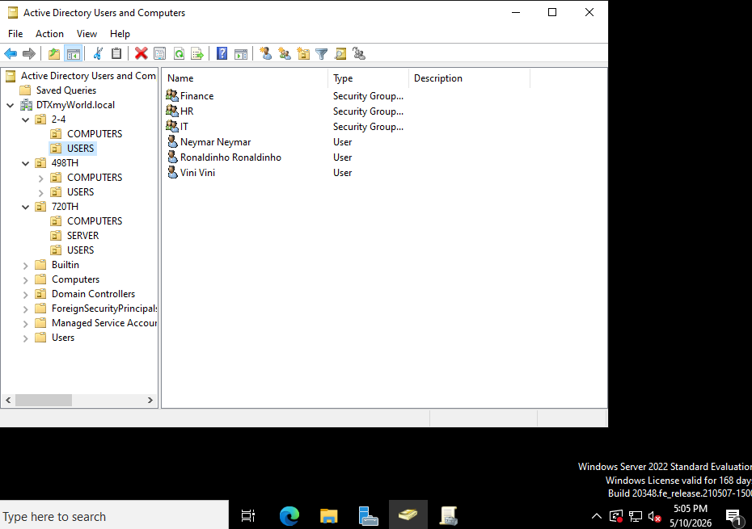
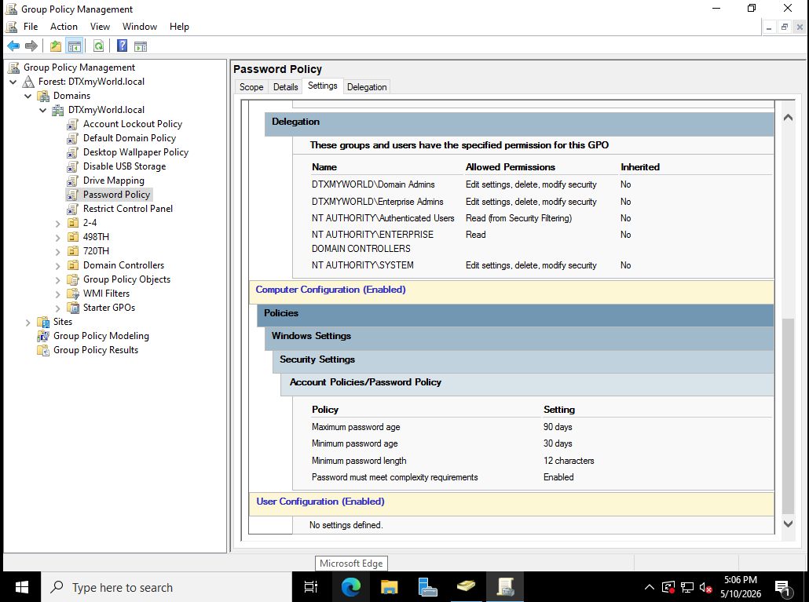
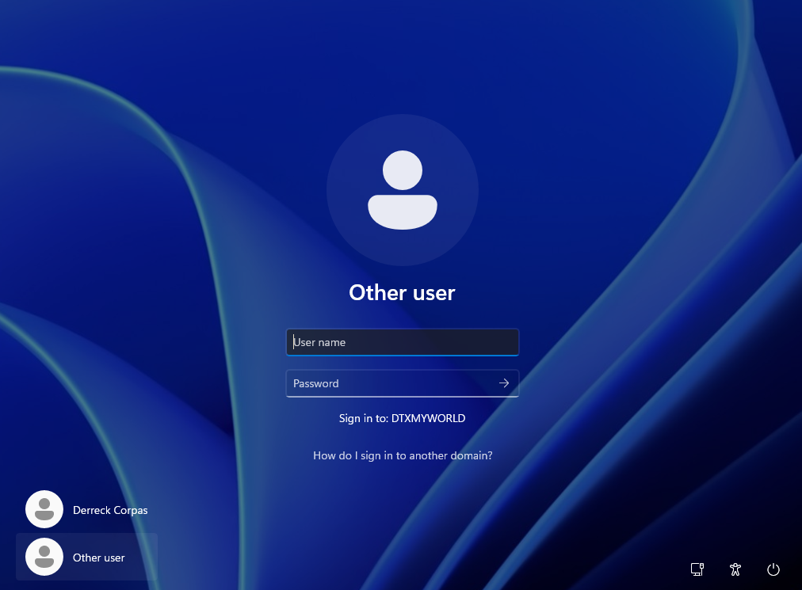

# Active_Directory_Homelab
I build an Active Directory Homelab using VMware
# Active Directory Homelab (VMware)

## Overview
Built a virtual Active Directory environment using VMware to simulate a real-world enterprise network.

## Environment
- Windows Server 2022 (Domain Controller)
- Windows 10 Client
- VMware Workstation

## Key Configurations
- Active Directory Domain Services (AD DS)
- DNS 
- Organizational Units (OUs)
- Group Policy Objects (GPOs)

## What I Did
- Created domain users, groups, and OUs
- Configured GPOs (password policy, lockouts, Control Panel)
- Joined client machine to domain
- Set up DNS for name resolution
- Tested authentication and access control
- Troubleshot domain connectivity issues

## Screenshots

## Skills Demonstrated
- System Administration
- Active Directory
- Windows Server
- Troubleshooting
